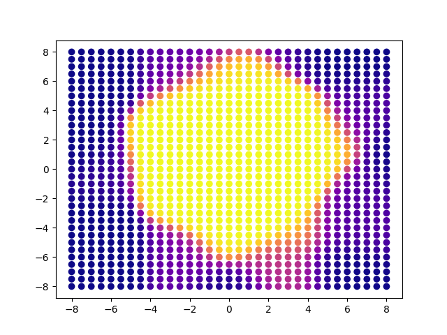
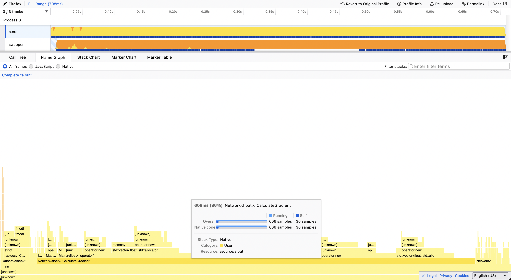

To compile the application, type `make`

# Performace

On an Apple computer with Apple silicon, you can create a flame-graph by using `make build-image-perf` followed by `make run-image-perf`.

You must copy the `profile.linux-perf.txt` into either of these web-application to generate a flame-graph.

* https://www.speedscope.app
* https://profiler.firefox.com

Unsurprisingly, the method `CalculateGradient` takes the most time.

# Memory Layout
To increase spatial locality, I updated my linear algebra library's matrix implementation. Rather than use `std::vector<std::vector<double>>` to store values of the matrix, I chose to use a single `std::vector<double>` and use `col_i * col_size + row_i` as my index. As a result, values of the matrix are stored continuously in memory. The previous implementation would not guarantee this. With the optimization flag set to `-g` and a neural network of dimension `2 * 8 * 8 * 2`, the program speeds up from `6.33s` to `5.22s`.